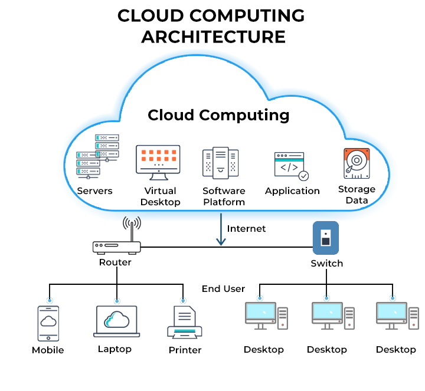
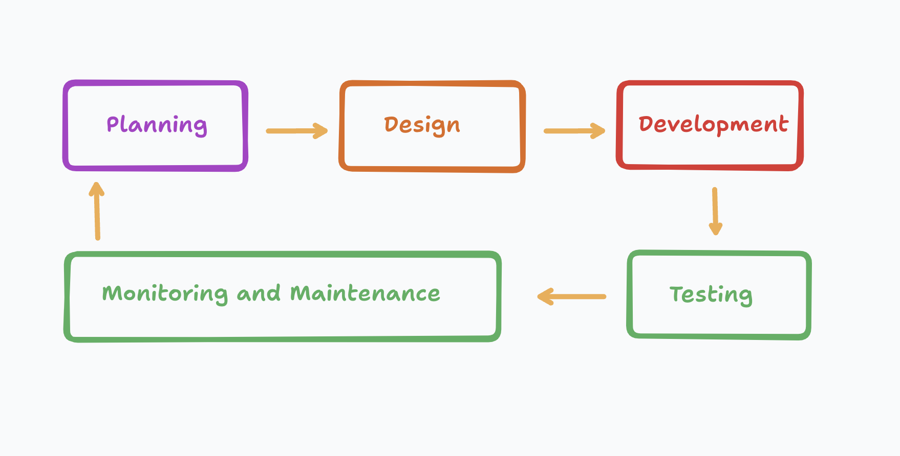
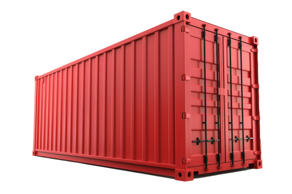
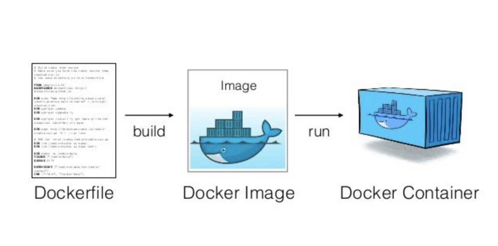

# Before diving into programming

It's essential to prepare our computers for the task. Setting up the right environment ensures that we can write and test code efficiently.

Just like a farmer needs to make the soil suitable for crops, we need to set up our computers for programming. This involves installing necessary software, such as a code editor or integrated development environment (IDE), programming languages, and other tools.

Here are some examples to illustrate the importance of preparation:
- Tracks need to be laid out for trains.
- Roads must be built for cars.

Proper setup creates a smooth pathway for our programming journey, allowing us to focus on learning and building projects effectively.

## Factors to Consider Before Starting Programming

### Choose a Programming Language:
- Decide which programming language you want to learn or use (e.g., Python, Java, JavaScript, C++, etc.).

### Install Necessary Software:
- Download and install the appropriate compiler or interpreter for the chosen language.
- Code Editor/IDE: VSCode, Visual Studio, PyCharm, etc.

### Set Up Environment Variables:
- Configure system PATH and environment variables to include necessary paths for compilers, interpreters, and other tools.

### Install Dependencies:
- Install essential libraries and frameworks required for your projects using the language-specific package manager.

### Virtual Environment (if applicable):
- For languages like Python, set up a virtual environment to manage project-specific dependencies.

# What is an Operating System?

An operating system is software that acts as an intermediary between the user and the computer hardware. It provides a user-friendly interface and manages the computer's resources efficiently.

## Main Functions of an Operating System

### Resource Management:

- **Processor Management**: Manages the CPU, ensuring that different tasks and applications get enough processing time to function properly.
- **Memory Management**: Keeps track of each byte in the computer’s memory and ensures that each application has enough memory to run.
- **Device Management**: Manages input and output devices such as keyboards, mice, printers, and monitors, ensuring they work correctly with software applications.
- **Storage Management**: Manages data storage, including files and directories on hard drives and other storage devices.

## Popular Operating Systems

- **Windows**
- **macOS**
- **Linux**

## What is Linux?

Linux is an open-source, Unix-like operating system kernel first released by Linus Torvalds in 1991. Known for its stability, security, and flexibility, Linux is widely used in servers, desktops, and embedded systems. It serves as the core of various Linux distributions (distros) like Ubuntu, Fedora, CentOS, and Debian.

### Key Features

- **Open Source**: Released under the GNU General Public License (GPL), allowing free use, modification, and distribution.
- **Security**: Known for robust security features.
- **Flexibility**: Can be used in a wide range of systems, from servers to desktops to embedded systems.
- **Stability and Performance**: Reliable performance in various environments.
- **Community Support**: Strong community support with extensive documentation and forums.

### Usage in Cloud Infrastructure

- **AWS**: Linux instances comprise around 92% of AWS's total instances (2020, CNCF).
- **Google Cloud**: Over 90% of Google's cloud infrastructure runs on Linux.
- **Microsoft Azure**: Linux-based instances account for around 60% of Azure's workload (2019).

Overall, Linux powers about 90% of all cloud infrastructure, driven by performance, cost-effectiveness, and extensive open-source tools.

----------------------------------------------------------

## What is a Cloud?

The "cloud" refers to servers that are accessed over the Internet, along with the software and databases that run on those servers. Cloud servers are located in data centers all over the world. By using the cloud, you can access these servers and the resources they offer from anywhere with an internet connection. This is beneficial for storing and managing data, running applications, and using services without having to manage physical hardware.

## What are Servers?

A server is a powerful computer that provides data, services, or resources to other computers, known as clients, over a network. Servers can perform various tasks, such as:

- **Hosting websites:** A web server stores the files for one or more websites and delivers them to users' browsers.
- **Running applications:** An application server provides software applications that clients can use.
- **Storing data:** A file server stores files and makes them accessible to clients.

## What are Client Machines?

Client machines, or simply clients, are the devices that people use to interact with servers. These devices can include:

- Personal computers (PCs)
- Laptops
- Smartphones
- Tablets

-----
## **Software Development Cycle**

---

## Challenges for Developers

#### 1. Environment Inconsistencies
Applications often behave differently on developers' machines, staging servers, and production servers due to variations in software versions, configurations, and dependencies.

#### 2. Dependency Conflicts
Multiple projects on the same machine could have conflicting dependencies, leading to complex and error-prone setup processes.

#### 3. Complex Deployment
Deploying applications involves manual steps, complex scripts, and varying setups for different environments, leading to errors and inefficiencies.

#### 4. Resource Overhead
Traditional VMs require separate operating systems, leading to high resource consumption and slow startup times.

#### 5. Scalability Challenges
Scaling applications often require complex configurations and management of multiple instances.

----
# Docker

# What is Docker?
 ***It's an open-source project that automates the deployment of software applications inside containers by providing an additional layer of abstraction and automation of OS-level virtualization on Linux.***

In simple words **Docker** is a tool that makes it easy to create, deploy, and run applications by using containers. **Containers** are like --lightweight, portable virtual machines that can run on any computer with the same behavior.

## Issues Resolved by Docker

### Environment Inconsistencies
Docker containers encapsulate all necessary dependencies and configurations, ensuring consistent behavior across different environments.

### Dependency Conflicts
Docker isolates applications and their dependencies, preventing conflicts and simplifying the setup process.

### Complex Deployment
Docker images bundle applications and their dependencies into a single package that can be easily deployed using standardized commands.

### Resource Overhead
Docker containers share the host OS kernel, reducing resource usage and enabling faster startup times.

### Scalability Challenges
Docker makes it easier to scale applications by allowing the creation and management of multiple container instances using orchestration tools like Kubernetes.

---
## **Container:** 
Think of it as a box that holds your application and everything it needs to run, such as libraries and dependencies. This box can be moved around and will work the same everywhere.

Containers are a key component of modern app development. They are executable units of software that contain all the necessary elements to run in any environment. Containers can virtualize the operating system and run anywhere, from a private data center to the public cloud or even on a developer's personal laptop.

## What is a Docker Image?
A Docker image serves as a blueprint for creating Docker containers. It defines what the container will contain and how it will behave

**Layers:**
 Docker images are made up of a series of layers. Each layer represents a change or addition, such as installing a package or adding a file. Layers are stacked on top of each other, and only changes are stored, making images efficient.

**Read-Only:** Once created, an image is immutable (read-only). This ensures that the image remains consistent and unchanged across different environments.

A Docker container is a running instance of a Docker image. It is created from an image and runs as an isolated process on the host system.
When a container is created, it uses the layers from the Docker image. A writable layer is added on top of these read-only layers, allowing the container to modify files and directories as it runs.

## Summary
Docker revolutionized the way developers build, ship, and run applications by providing a lightweight, portable, and consistent environment. It resolves many of the challenges faced in traditional development and deployment processes, making it a valuable tool for modern software development.
